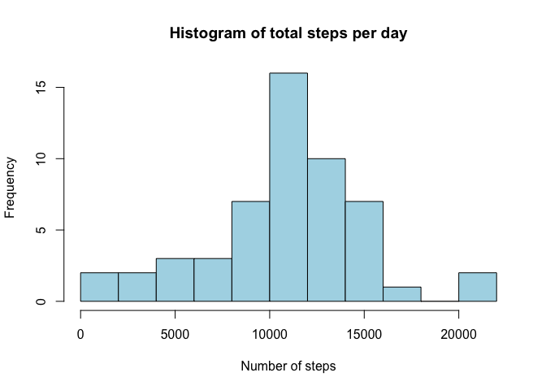
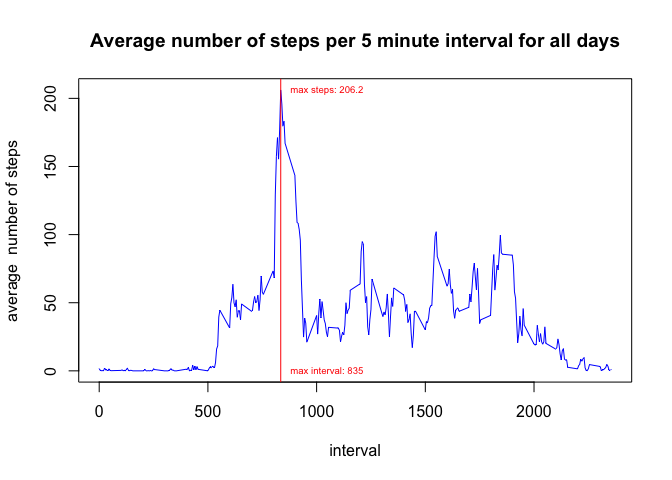
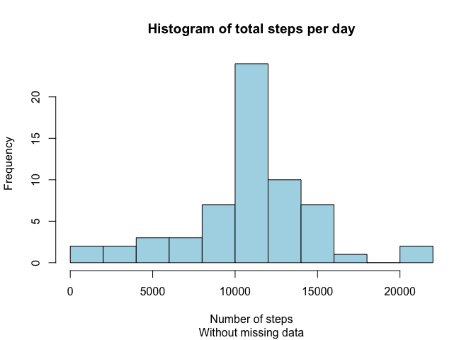
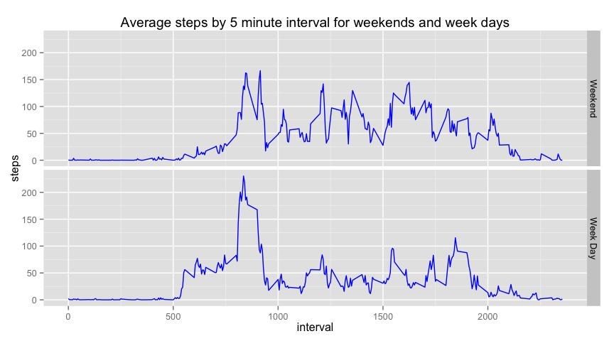

# Reproducible Research: Peer Assessment 1
## Utility functions

```r
  formatNumber <- function(num, decimals=1) formatC(num, format='f', digits=decimals)
  prettyMean <- function(v) formatNumber(mean(v),1)
  prettyMedian <- function(v) formatNumber(median(v),1)
  prettySum <- function(v) formatNumber(sum(v),0)
```


## Loading and preprocessing the data

1. The following steps we executed to load the data:

* forked the GitHub [course repository](https://github.com/rdpeng/RepData_PeerAssessment1)
* cloned the repository onto a directory - *repodir*
* unziped the file *activity.zip* which added a new file *activity.csv* to the directory *repodir*

2. Data processing and transformations
The data was first loaded into the dataframe *activity* from the csv file, activity.csv in the *data* directory and the following transaformations were applied:

* The *date* column was converted from *character* to *Date*
* A new factor variable *weekday* representing the day of week was added to the *activity* dataframe


```r
  # Loading the data into a dataframe called activity
  activity <- read.csv("activity.csv")
  
  # Convert the date column to Date class
  activity$date <- as.Date(strptime(activity$date, "%F"))
  
  # Add weekday variable
  activity$weekday <- as.factor(weekdays(activity$date))

  # Display first few rows
  head(activity)
```

```
##   steps       date interval weekday
## 1    NA 2012-10-01        0  Monday
## 2    NA 2012-10-01        5  Monday
## 3    NA 2012-10-01       10  Monday
## 4    NA 2012-10-01       15  Monday
## 5    NA 2012-10-01       20  Monday
## 6    NA 2012-10-01       25  Monday
```

The dataset was found to contain 17568 observations.

## Total number of steps taken per day
Below we calculate the total number of steps taken by day and display a histogram of the total number of steps per day.

```r
  #aggregate the steps by day and store result in a dataframe
  steps.per.day <- aggregate(steps ~ date, activity, FUN=sum)
  # Histogram of total steps per day
  hist(steps.per.day$steps, main="Histogram of total steps per day", xlab='Number of steps', col='lightblue',
       breaks=12)
```

 

The mean number of steps per day is 10766.2 and the median is 10765.0.


## Average daily activity pattern

```r
  # calculate the average number of steps per interval for all days
  intmean <- aggregate(steps ~ interval, activity, FUN=mean)

  # calculate the interval with the largest average number of steps
  largest.avg.steps.idx <- which(intmean$steps == max(intmean$steps))
  largest.avg.steps.interval <- intmean[largest.avg.steps.idx, "interval"]
  largest.avg.steps <- round(intmean[largest.avg.steps.idx, "steps"],1)
  
  # plot the average number of steps per 5 minute interval for all days
  plot(intmean$interval, intmean$steps, type='l', col='blue', 
       main='Average number of steps per 5 minute interval for all days', 
       ylab='average  number of steps', xlab='interval')

  # Draw a vertical line at the maximum point and label the interval and value
  abline(v=largest.avg.steps.interval, col='red')
  text(largest.avg.steps.interval, largest.avg.steps, 
       paste("max steps:",largest.avg.steps), cex=0.6, pos=4, col="red")
  text(largest.avg.steps.interval, 0, 
       paste("max interval:",largest.avg.steps.interval), cex=0.6, pos=4, col="red")
```

 

The interval with the largest average number of steps is 835 which has an average of 206.2 steps.

## Inputing missing values

1. There are 2304 rows with missing number of steps.

2. To fill in the missing data, will create a new dataframe *mactivity* that will contain the mean number of steps for the intervals that have missing steps data in the original dataset.

3. This will be acomplished by merging the the *activity* dataframe with the *intmean* dataframe that contains the average number of steps per interval. See code below.


```r
  # merge the dataframes by matching interval
  mactivity = merge(activity, intmean, by='interval')
  
  # reset the names post merge operation
  names(mactivity) <- c("interval", "steps", "date", "weekday", "meansteps")

  # set the missing values to the mean
  na.index <- is.na(mactivity$steps)
  mactivity[na.index, "steps"] <- mactivity[na.index, "meansteps"]
```

4. Histogram of the  a histogram of the total number of steps taken each day for the dataset with filled in steps for all days.


```r
  #aggregate the steps by day and store result in a dataframe
  msteps.per.day <- aggregate(steps ~ date, mactivity, FUN=sum)
  # Histogram of total steps per day
  hist(msteps.per.day$steps, main="Histogram of total steps per day", 
       sub="Without missing data", xlab='Number of steps', col='lightblue', breaks=12)
```

 

The choice of using the average of the steps per interval to input missing data has not changed the mean or median though it has increased the total number of steps. The table below shows a comparison of these sample statistics for the two data sets.

statistic|Original dataset|Modified dataset
---------|----------------|----------------
Mean |10766.2|10766.2
Median|10765.0|10766.2
Total|570608|656738

## Are there differences in activity patterns between weekdays and weekends?

1. Adding a new factor variable in the dataset with two levels – “weekday” and “weekend” indicating whether a given date is a weekday or weekend day.


```r
  # auxiliary function to calculate whether a day is a weekend
  is.weekend <- function(weekday) (weekday %in% c("Saturday", "Sunday"))
  
  # adding new factor variable to the modified data set
  mactivity$weekend <- as.factor(is.weekend(mactivity$weekday))
```

2. Panel plot containing a time series plot (i.e. type = "l") of the 5-minute interval (x-axis) and the average number of steps taken, averaged across all weekday days or weekend days (y-axis). 


```r
  library(ggplot2)

  # helper function to aggregate by weekend/weekday
  aggWeekendSteps <- function(is.weekend) {
    # calculate the average number of steps by interval for a subset of mactivity 
    s <- subset(mactivity, weekend == is.weekend)
    ag <- aggregate(steps ~ interval, s, FUN=mean)
    ag$weekend <- if (is.weekend) "Weekend" else "Week Day"    
    ag$weekend <- as.factor(ag$weekend)
    ag
  }

  # build a single dataframe with both data sets
  avg.steps <- rbind(aggWeekendSteps(TRUE), aggWeekendSteps(FALSE))

  # Prepare ggplot
  p <- ggplot(data=avg.steps, aes(x=interval, y=steps))
  p <- p + ggtitle("Average steps by 5 minute interval for weekends and week days") 
  p <- p + facet_grid(weekend ~ .) + geom_line(color="blue")
  p
```




